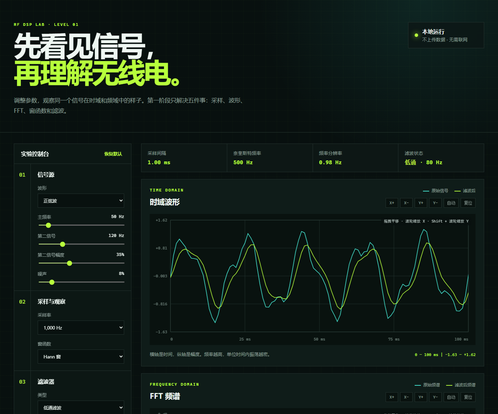

# RF DSP Lab

一个面向无线电、射频与数字信号处理初学者的中文交互式实验室。

无需安装依赖，直接在浏览器中学习信号的时域、频域和时频变化，并通过可调参数建立采样、FFT、窗函数、滤波、STFT 与模拟调制的直觉。



## 已上线课程

### 阶段 1：信号与频谱

- 正弦波与方波信号源
- 双音信号和可控噪声
- 主频率与第二频率支持 `0–20 kHz` 精确输入和滑块联动
- 自动采样率，可在 `500 Hz–96 kHz` 标准档位中选择
- 截止频率支持精确输入，并根据奈奎斯特频率自动限制
- 时域波形与 FFT 频谱
- 两张图独立缩放和平移
- 自动适配当前可见数据
- 悬停十字线与坐标读数
- 滚轮缩放横轴，`Shift + 滚轮`缩放纵轴
- 矩形窗、Hann 窗、Hamming 窗和 Blackman 窗
- RC 一阶 IIR、可调 Q 双二阶 IIR、2–8 阶 Butterworth IIR
- 11–401 taps 窗函数 FIR，支持矩形、Hann、Hamming、Blackman 窗
- 各滤波器支持低通/高通和精确截止频率设置
- 奈奎斯特频率和混叠提示
- 四个引导式实验预设

频率升高时，时域图会自动显示约 8 个周期；手动缩放或拖拽后会保留用户视角。

### 阶段 2：时频与模拟调制

- STFT 时频图和整段 FFT 对照
- 线性扫频、跳频、脉冲音和双音交替
- 可调 STFT 窗长、重叠率和采样率
- 时间分辨率、频率分辨率和帧移读数
- AM 载波、上下边带、调制度和过调制实验
- FM 载波、消息频率、频偏、调制指数和 Carson 带宽
- 三张图独立缩放、平移、自动适配和悬停坐标读数
- 四个第二阶段引导实验

项目还提供六阶段学习路线页，可从基础频谱逐步前往数字调制、IQ 基带、信号测量与 SDR 实战。

### 阶段 3：数字调制

- 2-ASK / OOK、2-FSK、BPSK 和 QPSK
- 可编辑比特序列与随机比特生成
- 码元率、每码元采样数、Eb/N0、FSK 频率间隔和相位偏差
- 通带波形、星座图、眼图和 BER 参考曲线
- 理想码元与噪声接收点对照
- 发送比特与接收判决逐位对照
- 当前误码率、比特率、每码元比特数和频谱效率读数
- 四个第三阶段引导实验

### 阶段 4：IQ 与复数基带

- QPSK、8PSK、16QAM 和复数单音
- 射频载波、本振频偏、相位偏差、信噪比和符号率参数
- I/Q 幅度失衡、正交误差和 DC 偏置
- I/Q 时间序列、复数轨迹与星座、下变频后频谱
- 自动采样率、复数带宽、残余频偏和 EVM 指标
- 接收机现象速查，帮助判断频偏、相偏、I/Q 失衡和 EVM 问题
- 四个第四阶段引导实验

### 阶段 5：信号测量与文件分析

- 窄带 FM、OOK 脉冲、扫频雷达脉冲和复数 IQ / QPSK 模拟信号
- WAV、CSV、TXT / IQ 文本导入
- 峰值频率、占用带宽（OBW）、SNR、占空比和活动频率线索
- 时域包络、频谱测量、短时频谱瀑布图和测量报告
- 占用功率、活动门限、频谱窗、采样率和观测时长参数
- 可复制的测量报告
- 四个第五阶段引导实验

## 快速开始

直接打开以下页面即可使用：

- `index.html`：阶段 1
- `stage2.html`：阶段 2
- `stage3.html`：阶段 3
- `stage4.html`：阶段 4
- `stage5.html`：阶段 5
- `roadmap.html`：完整学习路线

也可以启动任意静态文件服务器：

```powershell
npx serve .
```

然后在浏览器中访问终端显示的本地地址。

## 图表操作

| 操作 | 功能 |
| --- | --- |
| 鼠标拖拽 | 平移当前视图 |
| 鼠标滚轮 | 缩放横轴 |
| `Shift + 滚轮` | 缩放纵轴 |
| 双击图表 | 恢复默认视图 |
| `X+` / `X-` | 放大或缩小横轴 |
| `Y+` / `Y-` | 放大或缩小纵轴 |
| 自动 | 显示全部数据并自动适配纵轴 |
| 复位 | 恢复该图默认观察范围 |

## 学习路线

1. 基础信号、采样、FFT、窗函数与滤波
2. STFT、瀑布图、AM 与 FM 模拟调制
3. ASK、FSK、BPSK 与 QPSK 数字调制
4. IQ 信号、复数基带、下变频与 EVM
5. WAV、CSV、IQ 文件导入与信号测量
6. 连接 SDR 硬件并完成接收链

详细目标见 [LEARNING_PATH.md](LEARNING_PATH.md)。

## 项目结构

```text
rf-dsp-lab/
├── assets/
│   └── preview.png
├── app.js
├── index.html
├── roadmap.html
├── stage2.html
├── stage2.css
├── stage2.js
├── stage3.html
├── stage3.css
├── stage3.js
├── stage4.html
├── stage4.css
├── stage4.js
├── stage5.html
├── stage5.css
├── stage5.js
├── styles.css
├── LEARNING_PATH.md
├── CHANGELOG.md
├── .gitignore
└── README.md
```

## 当前版本

`v0.5.0`：上线第五阶段信号测量与文件分析实验室，新增 WAV/CSV/IQ 导入、峰值频率、OBW、SNR、占空比、瀑布图和测量报告。

详细更新内容见 [CHANGELOG.md](CHANGELOG.md)。

## 浏览器支持

建议使用最新版 Chrome、Edge 或 Firefox。
